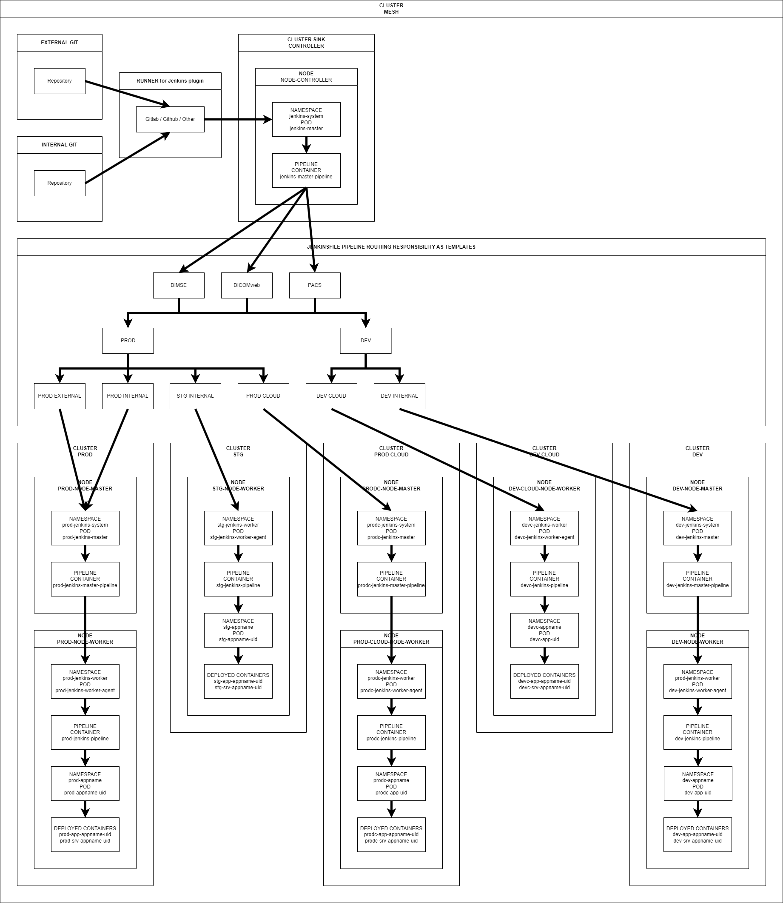
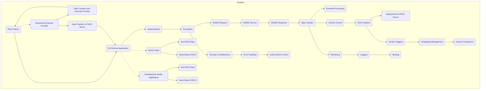

# devops-installation

## Load Balancing definition for Cluster Mesh IP range

```yaml
- name: sink-cluster
  subnet: 10.0.0.0/14
  nodes:
    - name: sink-node-master-1
      type: node
      subnet: 10.0.0.0/19
      pods:
        - name: s-jenkins-master
          namespace: s-jenkins-master
          subnet: 10.0.6.0/23
          sc: s-jenkins-master-sc
          pv: s-jenkins-master-pv
          pvc: s-jenkins-master-pvc
        - name: s-prod-pod-worker
          namespace: s-prod-pod-worker
          subnet: 10.0.8.0/21
          sc: s-prod-load-balancer-sc
          pv: s-prod-load-balancer-pv
          pvc: s-prod-load-balancer-pvc
          containers:
            - name: s-prod-load-balancer-1
            - name: s-prod-load-balancer-2
            - name: s-prod-load-balancer-3
        - name: s-prodc-pod-worker
          namespace: s-prodc-pod-worker
          subnet: 10.0.16.0/21
          sc: s-prodc-load-balancer-sc
          pv: s-prodc-load-balancer-pv
          pvc: s-prodc-load-balancer-pvc
          containers:
            - name: s-prodc-load-balancer-1
            - name: s-prodc-load-balancer-2
            - name: s-prodc-load-balancer-3
    - name: sink-node-master-2
      subnet: 10.0.32.0/19
      pods:
        - name: s-jenkins-master
          namespace: s-jenkins-master
          subnet: 10.0.38.0/23
          sc: s-jenkins-master-sc
          pv: s-jenkins-master-pv
          pvc: s-jenkins-master-pvc
        - name: s-stg-pod-worker
          namespace: s-stg-pod-worker
          subnet: 10.0.40.0/21
          sc: s-stg-load-balancer-sc
          pv: s-stg-load-balancer-pv
          pvc: s-stg-load-balancer-pvc
          containers:
            - name: s-stg-load-balancer-1
            - name: s-stg-load-balancer-2
            - name: s-stg-load-balancer-3
        - name: s-ext-pod-worker
          namespace: s-ext-pod-worker
          subnet: 10.0.48.0/21
          sc: s-ext-load-balancer-sc
          pv: s-ext-load-balancer-pv
          pvc: s-ext-load-balancer-pvc
          containers:
            - name: s-ext-load-balancer-1
            - name: s-ext-load-balancer-2
            - name: s-ext-load-balancer-3
    - name: sink-node-master-3
      subnet: 10.0.64.0/19
      pods:
        - name: s-jenkins-master
          namespace: s-jenkins-master
          subnet: 10.0.70.0/23
          sc: s-jenkins-master-sc
          pv: s-jenkins-master-pv
          pvc: s-jenkins-master-pvc
        - name: s-dev-pod-worker
          namespace: s-dev-pod-worker
          subnet: 10.0.72.0/21
          sc: s-dev-load-balancer-sc
          pv: s-dev-load-balancer-pv
          pvc: s-dev-load-balancer-pvc
          containers:
            - name: s-dev-load-balancer-1
            - name: s-dev-load-balancer-2
            - name: s-dev-load-balancer-3
        - name: s-devc-pod-worker
          namespace: s-devc-pod-worker
          subnet: 10.0.80.0/21
          sc: s-devc-load-balancer-sc
          pv: s-devc-load-balancer-pv
          pvc: s-devc-load-balancer-pvc
          containers:
            - name: s-devc-load-balancer-1
            - name: s-devc-load-balancer-2
            - name: s-devc-load-balancer-3
- name: dev-cluster:
  subnet: 10.4.0.0/14
  nodes:
    - name: dev-node-master
      type: node
      subnet: 10.4.0.0/19
      pods:
        - name: dev-jenkins-master
          namespace: s-jenkins-master
          subnet: 10.4.6.0/23
          sc: dev-jenkins-master-sc
          pv: dev-jenkins-master-pv
          pvc: dev-jenkins-master-pvc
    - name: dev-node-worker
      subnet: 10.4.32.0/19
      pods:
        - name: dev-jenkins-worker
          namespace: dev-jenkins-worker
          subnet: 10.0.38.0/23
          sc: dev-jenkins-worker-sc
          pv: dev-jenkins-worker-pv
          pvc: dev-jenkins-worker-pvc

- name: dev-cloud-cluster:
  subnet: 10.8.0.0/16
  nodes:
    - name: devc-node-master
      type: node
      subnet: 10.8.0.0/19
      pods:
        - name: devc-jenkins-master
          namespace: devc-jenkins-master
          subnet: 10.8.6.0/23
          sc: devc-jenkins-master-sc
          pv: devc-jenkins-master-pv
          pvc: devc-jenkins-master-pvc
    - name: devc-node-worker
      subnet: 10.8.32.0/19
      pods:
        - name: devc-jenkins-worker
          namespace: devc-jenkins-worker
          subnet: 10.8.38.0/23
          sc: devc-jenkins-worker-sc
          pv: devc-jenkins-worker-pv
          pvc: devc-jenkins-worker-pvc

- name: prod-cluster:
  subnet: 10.12.0.0/14
  nodes:
    - name: prod-node-master
      type: node
      subnet: 10.12.0.0/19
      pods:
        - name: prod-jenkins-master
          namespace: prod-jenkins-master
          subnet: 10.12.6.0/23
          sc: prod-jenkins-master-sc
          pv: prod-jenkins-master-pv
          pvc: prod-jenkins-master-pvc
    - name: prod-node-worker
      subnet: 10.8.32.0/19
      pods:
        - name: prod-jenkins-worker
          namespace: prod-jenkins-worker
          subnet: 10.12.38.0/23
          sc: prod-jenkins-worker-sc
          pv: prod-jenkins-worker-pv
          pvc: prod-jenkins-worker-pvc

- name: prod-cloud-cluster:
  subnet: 10.16.0.0/14
  nodes:
    - name: prodc-node-master
      type: node
      subnet: 10.16.0.0/19
      pods:
        - name: prodc-jenkins-master
          namespace: prodc-jenkins-master
          subnet: 10.16.6.0/23
          sc: prodc-jenkins-master-sc
          pv: prodc-jenkins-master-pv
          pvc: prodc-jenkins-master-pvc
    - name: prodc-node-worker
      subnet: 10.16.32.0/19
      pods:
        - name: prodc-jenkins-worker
          namespace: prodc-jenkins-worker
          subnet: 10.16.38.0/23
          sc: prodc-jenkins-worker-sc
          pv: prodc-jenkins-worker-pv
          pvc: prodc-jenkins-worker-pvc

- name: stg-cluster:
  subnet: 10.20.0.0/16
  nodes:
    - name: stg-node-master
      type: node
      subnet: 10.20.0.0/19
      pods:
        - name: devc-jenkins-master
          namespace: devc-jenkins-master
          subnet: 10.20.6.0/23
          sc: devc-jenkins-master-sc
          pv: devc-jenkins-master-pv
          pvc: devc-jenkins-master-pvc
    - name: devc-node-worker
      subnet: 10.20.32.0/19
      pods:
        - name: devc-jenkins-worker
          namespace: devc-jenkins-worker
          subnet: 10.20.38.0/23
          sc: devc-jenkins-worker-sc
          pv: devc-jenkins-worker-pv
          pvc: devc-jenkins-worker-pvc

```

## Pipeline workflow



## Installation script - full_install.sh (Set-up not completed for -> storage class, persistent volumes, persistent volume claims, network, RBAC etc.)

```bash
/bin/bash install_kubernetes_cluster.sh
sleep 200
/bin/bash install_helm.sh
/bin/bash install_kubernetes_prometheus.sh
/bin/bash install_kubernetes_grafana.sh
/bin/bash install_kubernetes_elasticsearch.sh
/bin/bash install_kubernetes_jenkins_master.sh
/bin/bash install_kubernetes_jenkins_agents.sh
/bin/bash install_kubernetes_sonarqube.sh
```


## Design a CI/CD Pipeline

```yaml
- name: Jenkins
  description: "Automation of build, test, pipeline definition, and application deployment."
  tools: Jenkins

- name: Docker
  description: "Containerization of the application and communication with images."
  tools: Docker, containerd

- name: Kubernetes
  description: "Orchestration and deployment of containers."
  tools: Kubernetes

- name: Helm
  description: "Package management and application deployment to Kubernetes."
  tools: Helm

- name: Prometheus
  description: "Collection of monitoring data."
  tools: Prometheus

- name: Grafana
  description: "Visualization of application performance monitoring and alerting."
  tools: Grafana

- name: ELK Stack
  description: "Collection, analysis, and visualization of logs."
  tools: Elasticsearch, Logstash, Kibana

```

## CI/CD Pipeline templates:

### Continuous integration

```yaml
- name: Checkout Source Code
  description: "Download source code from the repository."
  tools: Git, Curl, and more

- name: Static Code Analysis
  description: "Check static code for potential errors and deficiencies."
  tools: SonarQube, and more

- name: Dependency Installation
  description: "Install dependencies and packages required for building and testing the application."
  tools: npm, pip, and more

- name: Unit Testing
  description: "Run unit tests to verify the functionality of individual parts of the application."
  tools: Jest, JUnit, PHPUnit, and more

```

### Continuous delivery and deployment

```yaml
- name: Build
  description: "Stage for building source code into executable package or container."
  tools: Docker, Gradle, Buildozer, webpack, and more

- name: Container Image Scanning
  description: "Stage for scanning Docker images to detect security risks."
  tools: Docker Security Scanning, Twistlock

- name: Integration Testing
  description: "Stage for running integration tests to verify application behavior."
  tools: Selenium, JUnit, pytest, and more

- name: Artifact Storage
  description: "Stage for storing the resulting artifacts for deployment."
  tools: Docker Registry, Nexus, Artifactory

- name: Deploy to Staging Environment
  description: "Stage for deploying the application to a staging environment for testing."
  tools: Kubernetes, Docker Compose

- name: Smoke Testing
  description: "Stage for running basic tests to verify application functionality."
  tools: Postman, Newman, curl

- name: Deploy to Production
  description: "Stage for deploying the application to the production environment."
  tools: Kubernetes, Helm, Ansible

- name: Rollback
  description: "Stage for automatic rollback in case of deployment failures."
  tools: Kubernetes Rollback, Jenkins Blue/Green Deployment

- name: Monitoring Configuration
  description: "Stage for configuring monitoring for application performance."
  tools: Prometheus, Grafana

- name: Load Testing
  description: "Stage for running load tests to evaluate application performance."
  tools: JMeter, Gatling

- name: Security Scanning
  description: "Stage for scanning the application for security vulnerabilities."
  tools: Clair, Anchore

- name: Integration with Monitoring Tools
  description: "Stage for integrating with monitoring tools for application and infrastructure monitoring."
  tools: Prometheus, Grafana

- name: Alerting Configuration
  description: "Stage for configuring alerts for rapid response to production issues."
  tools: Alertmanager, PagerDuty

- name: Documentation Generation (optional)
  description: "Stage for generating code or user documentation."
  tools: Swagger, Doxygen, Sphinx

- name: Cleanup
  description: "Stage for cleaning up temporary files and artifacts used during the pipeline."
  tools: Helm, Kubectl, rm, and more

```

### CI/CD Pipeline diagram

```mermaid
graph TD
    subgraph CI_CD_Pipeline
        id31("Continuous Integration")
        id32("Checkout Source Code")
        id33("Static Code Analysis")
        id34("Dependency Installation")
        id35("Unit Testing")

        id36("Continuous Delivery and Deployment")
        id37("Build")
        id38("Container Image Scanning")
        id39("Integration Testing")
        id40("Artifact Storage")
        id41("Deploy to Staging Environment")
        id42("Smoke Testing")
        id43("Deploy to Production")
        id44("Rollback")
        id45("Monitoring Configuration")
        id46("Load Testing")
        id47("Security Scanning")
        id48("Integration with Monitoring Tools")
        id49("Alerting Configuration")
        id50("Documentation Generation (optional)")
        id51("Cleanup")

        id31 --> id32
        id32 --> id33
        id33 --> id34
        id34 --> id35

        id31 --> id36
        id36 --> id37
        id37 --> id38
        id38 --> id39
        id39 --> id40
        id40 --> id41
        id41 --> id42
        id42 --> id43
        id43 --> id44
        id44 --> id45
        id45 --> id46
        id46 --> id47
        id47 --> id48
        id48 --> id49
        id49 --> id50
        id50 --> id51
    end
```



## Monitoring and protection

```yaml
application_monitoring:
  key_metrics:
    - cpu_memory_utilization
    - latency_response_time
    - data_throughput
    - error_codes_exceptions
    - request_count

  monitoring_tools:
    - name: Prometheus
      purpose: Collect time-series data for monitoring application metrics.
      features:
        - alerting_rules: Define alerting rules for immediate issue detection.
        - recording_rules: Create custom aggregated metrics for in-depth analysis.
    - name: Grafana
      purpose: Create customizable dashboards and visualize collected metrics.
      features:
        - dashboard_creation: Design interactive dashboards for various stakeholders.
        - anomaly_detection: Utilize features like Loki for log-based anomaly detection.
    - name: ELK Stack (Elasticsearch, Logstash, Kibana)
      purpose: Collect, analyze, and visualize logs for troubleshooting and monitoring.
      features:
        - log_shippers: Use Beats for shipping logs to Elasticsearch.
        - log_analysis: Leverage Kibana for detailed log analysis and visualization.

  monitoring_strategy:
    cloud_environment:
      - tool_availability: Utilize cloud-native monitoring services (e.g., AWS CloudWatch, Google Cloud Monitoring).
        - integrated_services: Explore additional services like AWS X-Ray for distributed tracing.
      - configuration_options: Leverage pre-configured integrations for ease of setup.
        - auto-scaling_integration: Integrate with auto-scaling services for dynamic adjustments.
    on_premise_environment:
      - tool_availability: Deploy self-hosted monitoring solutions (e.g., Prometheus, Grafana, ELK Stack).
        - custom_configurations: Implement tailored configurations for specific infrastructure requirements.
      - configuration_options: Customize configurations based on specific infrastructure and application needs.
        - on_premise_alerting: Implement on-premise alerting solutions for security and compliance.

  monitoring_responsibility:
    - software: Prometheus, Grafana, ELK Stack
      responsibility: Collect, analyze, and visualize application metrics and logs.
    - software: New Relic, Datadog
      responsibility: Implement advanced application performance monitoring with additional insights.
    - software: Dynatrace, AppDynamics
      responsibility: Provide end-to-end application performance monitoring with AI-driven insights.

  testing:
    - tool: JMeter
      purpose: Conduct performance testing to evaluate application scalability and identify bottlenecks.
      features:
        - distributed_testing: Scale testing with distributed setups for realistic scenarios.
        - performance_metrics: Collect detailed performance metrics during testing.
    - tool: Selenium
      purpose: Perform end-to-end testing to ensure proper functionality across different components.
      features:
        - cross_browser_testing: Validate application behavior across various browsers.
        - test_automation: Implement automated test scripts for continuous testing.
    - tool: Gatling
      purpose: Conduct stress testing to evaluate application behavior under high loads.
      features:
        - scenario_simulation: Simulate real-world scenarios to assess application resilience.
        - reporting_analytics: Generate comprehensive reports for performance analysis.

  periodic_reviews:
    - frequency: Regular intervals (e.g., quarterly)
      actions: Review monitoring configurations, update tools, and adjust alerting thresholds.
      features:
        - trend_analysis: Analyze trends in historical data for proactive improvements.
        - cost_optimization: Evaluate resource usage for cost optimization in cloud environments.
    - frequency: Continuous
      actions: Conduct continuous performance testing and monitor for performance regressions.
      features:
        - continuous_integration: Integrate performance testing into continuous integration pipelines.
        - automated_alerting: Set up automated alerts for performance anomalies.

intellectual_property_protection:
  security_measures:
    - access_limitation:
        - strong_passwords
        - two_factor_authentication
        - role_based_access_control
        - biometric_access
      features:
        - privileged_access_monitoring: Implement monitoring for privileged access.
        - access_audit_trail: Maintain an audit trail for access-related activities.
    - data_encryption:
        - in_transit: Utilize TLS/SSL for encrypted communication.
        - at_rest: Encrypt sensitive data at rest using tools like HashiCorp Vault.
      features:
        - data_classification: Classify data to determine encryption requirements.
        - key_management: Implement robust key management practices.
    - monitoring_auditing:
        - network_traffic: Monitor network traffic with tools like Suricata or Zeek.
        - access_logs: Audit access logs with solutions like Auditbeat.
      features:
        - behavior_analysis: Employ behavior analysis for anomaly detection.
        - real_time_alerting: Enable real-time alerts for suspicious activities.
    - network_protection:
        - firewall_configuration: Configure firewalls with tools like iptables or firewalld.
        - security_policies: Enforce security policies with solutions like Open Policy Agent (OPA).
      features:
        - threat_intelligence_integration: Integrate threat intelligence feeds for proactive protection.
        - automated_security_updates: Implement automated security updates for network devices.
    - container_security:
        - runtime_scanning: Conduct runtime scanning of containers for vulnerabilities.
        - image_signing: Sign container images to ensure integrity and authenticity.
      features:
        - container_runtime_policies: Enforce security policies at the container runtime level.
        - container_hardening_guidelines: Follow container hardening guidelines for secure deployments.

  legal_protection:
    - contracts_licenses:
        - contracts: Ensure contracts include clauses for intellectual property protection.
        - licenses: Use appropriate software licenses (e.g., GPL, MIT) for Docker images.
      features:
        - legal_review: Regularly review and update contracts to align with legal standards.
        - license_compliance_checks: Implement checks for license compliance in software.
    - internal_training:
        - security_awareness: Conduct regular security awareness training for employees.
        - incident_response_training: Train teams for effective incident response and mitigation.
      features:
        - phishing_simulations: Conduct phishing simulations to enhance awareness.
        - tabletop_exercises: Organize tabletop exercises for incident response practice.
    - regulatory_compliance:
        - GDPR: Ensure compliance with the General Data Protection Regulation (GDPR).
        - HIPAA: Adhere to the Health Insurance Portability and Accountability Act (HIPAA) requirements.
      features:
        - data_privacy_measures: Implement measures to protect sensitive data as per regulatory requirements.
        - compliance_audits: Conduct regular audits to ensure adherence to regulatory standards.

software_responsibility:
  - software: SecuritySuite
    components:
      - monitoring: Prometheus, Grafana, ELK Stack, New Relic, Datadog, Dynatrace, AppDynamics
      - testing: JMeter, Selenium, Gatling
      - security_measures:
          - access_limitation
          - data_encryption
          - monitoring_auditing
          - network_protection
          - container_security
        features:
          - continuous_security_scanning: Integrate security scanning into CI/CD pipelines.
          - threat_modeling: Conduct threat modeling for proactive risk identification.
      - legal_protection:
          - contracts_licenses
          - internal_training
          - regulatory_compliance
        features:
          - compliance_reporting: Generate compliance reports for legal assessments.
          - incident_response_integration: Integrate incident response plans into security operations.
      - kubernetes_integration:
          - RBAC: Implement Role-Based Access Control for fine-grained access management.
          - IAM: Integrate with Identity and Access Management solutions for centralized authentication.
          - Azure_credentials: Securely manage Azure credentials using secrets management solutions.
        features:
          - cloud_native_security: Implement security measures tailored for cloud-native environments.
          - container_orchestration_security: Ensure security across container orchestration platforms like Kubernetes.

```

## Communication details for PACS, DICOM, DINSE etc.

```yaml
name: PACS Communication
description: Stage for communication between Development Team and Hospital PACS
steps:
  - name: DICOMweb Communication
    description: Interact with PACS using DICOMweb services
    details: |
      DICOMweb Communication:
      - Purpose: Establish communication with PACS using DICOMweb services.
      - Tools:
        - DICOMweb API
        - HTTP(S) protocol
      - Step-by-step:
        1. Authentication and Authorization:
          - Authenticate with DICOMweb services using authentication keys or other secure methods.
          - Obtain permissions to access necessary resources on the PACS server.
        
        2. Querying (DICOM QIDO-RS):
          - Construct DICOM queries to retrieve required data from PACS.
          - Send the query to the PACS server using DICOMweb services.
          - Process and interpret the response from the PACS server.
        
        3. Retrieve (DICOM WADO-RS):
          - Identify and retrieve specific records or files based on the executed query.
          - Verify the completeness and integrity of the retrieved data.
        
        4. Storing (DICOM STOW-RS):
          - Prepare data for submission to PACS for storage.
          - Send data to the PACS server, ensuring proper storage.
        
        5. Updating (DICOM WADO-RS with PUT):
          - Update existing data on the PACS server based on performed changes or corrections.
          - Send updated data with appropriate identifiers.
        
        6. Deletion (DICOM WADO-RS with DELETE):
          - Identify and delete unwanted or outdated data from the PACS server.
          - Send a deletion request and confirm the execution of the operation.
        
        7. Error Handling (DICOM DIMSE):
          - Detect and identify errors or exceptions during DICOMweb communication.
          - Log error information and prepare for issue resolution.
        
        8. Security Considerations:
          - Implement security measures to protect transmitted data and secure communication.
          - Regularly update authentication keys and check permissions.
        
        9. Audit Logging:
          - Record significant events and operations performed within DICOMweb communication.
          - Retain audit logs for monitoring, analysis, and compliance adherence.
        
        10. Monitoring:
          - Implement monitoring tools to track the performance and availability of DICOMweb services.
          - Regularly check the communication status and identify potential issues.
        
        11. Data Transformation (DICOMweb C-FIND/C-MOVE):
          - Transform data into DICOM format if necessary before transmission.
          - Utilize DICOMweb C-FIND/C-MOVE services for querying and retrieving specific DICOM objects.
        
        12. Data Validation (DICOM Conformance):
          - Validate DICOM objects for conformance to standard specifications.
          - Ensure adherence to DICOM data structure and encoding rules.
        
        13. Compression (DICOMweb WADO-RS with compression):
          - Implement data compression techniques for efficient data transmission.
          - Utilize compression algorithms supported by DICOMweb services.
        
        14. Concurrency Control (DICOMweb ETags):
          - Manage concurrent access to DICOM resources to prevent conflicts.
          - Utilize ETags for resource versioning and concurrency control.
        
        15. Throttling and Rate Limiting:
          - Implement throttling and rate limiting mechanisms to regulate traffic.
          - Control the frequency and volume of requests to maintain service stability.
        
        16. Error Recovery and Retry Logic:
          - Design error recovery strategies to handle transient errors during communication.
          - Implement retry logic with exponential backoff for failed requests.
        
        17. Event Notification (DICOMweb STOW-RS with callbacks):
          - Enable event notification mechanisms for asynchronous processing.
          - Utilize callbacks with DICOMweb STOW-RS to notify about data storage events.
        
        18. Cross-Origin Resource Sharing (CORS) Configuration:
          - Configure CORS policies to allow secure communication between different origins.
          - Define allowed origins, methods, and headers for DICOMweb requests.
        
        19. Session Management:
          - Establish and manage DICOMweb sessions for stateful communication.
          - Maintain session tokens or identifiers for subsequent requests.
        
        20. Metadata Retrieval (DICOMweb QIDO-RS):
          - Retrieve metadata associated with DICOM objects using DICOMweb QIDO-RS.
          - Extract and analyze metadata attributes for further processing.
        
        21. DICOM Tag Filtering:
          - Apply DICOM tag filters to narrow down search criteria and optimize query results.
          - Specify relevant DICOM tags for querying specific attributes.
        
        22. DICOM Service Logs:
          - Capture and maintain logs of DICOMweb service interactions for audit and troubleshooting purposes.
          - Record details such as timestamp, request parameters, and response codes.
        
        23. DICOM Extended Query Options:
          - Explore and utilize extended query options provided by DICOMweb services.
          - Incorporate advanced query parameters for fine-grained data retrieval.
        
        24. DICOM Instance Retrieval (DICOMweb WADO-RS):
          - Retrieve individual DICOM instances or frames using DICOMweb WADO-RS.
          - Specify instance identifiers and frame numbers for targeted retrieval.
        
        25. Data Integrity Checks:
          - Perform data integrity checks during transmission and storage of DICOM objects.
          - Verify checksums or hash values to ensure data integrity and authenticity.
        
        26. DICOM Data Anonymization:
          - Implement DICOM data anonymization techniques to protect patient privacy.
          - Apply anonymization rules compliant with DICOM standard guidelines.
        
        27. DICOM Protocol Versioning:
          - Support multiple DICOM protocol versions for backward and forward compatibility.
          - Handle DICOM protocol negotiation to accommodate varying client and server versions.
        
        28. DICOM Object Serialization (DICOMweb WADO-RS with compression):
          - Serialize DICOM objects into compatible formats for transmission and storage.
          - Utilize compression algorithms to optimize serialization size and speed.
        
        29. DICOM Bulk Data Transfer (DICOMweb STOW-RS with batch processing):
          - Enable bulk data transfer capabilities for efficient handling of large datasets.
          - Utilize batch processing with DICOMweb STOW-RS to streamline data upload operations.
        
        30. DICOM Resource Management (DICOMweb ETags and concurrency control):
          - Manage DICOM resources effectively using ETags and concurrency control mechanisms.
          - Prevent resource conflicts and ensure consistent resource management.
        
        31. DICOM Metadata Modification (DICOMweb QIDO-RS with WADO-RS):
          - Modify metadata associated with DICOM objects using DICOMweb QIDO-RS and WADO-RS.
          - Update metadata attributes such as patient demographics or study information.
        
        32. DICOM Instance Deletion (DICOMweb Delete Transaction):
          - Delete individual DICOM instances or entire studies using DICOMweb Delete transaction.
          - Ensure compliance with regulatory requirements and data retention policies.
        
        33. DICOM Extended Retrieval Options (DICOMweb WADO-RS with custom queries):
          - Explore custom query options for extended retrieval of DICOM objects.
          - Implement advanced query filters to retrieve specific subsets of data.
        
        34. DICOM Query Optimization (DICOMweb QIDO-RS with query tuning):
          - Optimize DICOM queries for improved performance and resource utilization.
          - Fine-tune query parameters and indexing strategies for efficient data retrieval.
        
        35. DICOM Transfer Syntax Negotiation:
          - Negotiate transfer syntax options during DICOM object transmission.
          - Support multiple transfer syntaxes for compatibility with diverse DICOM clients.
        
        36. DICOM Audit Trail Logging (DICOMweb Audit Trail):
          - Log and monitor DICOMweb transactions to create an audit trail of activities.
          - Capture details such as user actions, accessed resources, and timestamps.
        
        37. DICOM Error Logging and Reporting:
          - Capture and log errors encountered during DICOM communication.
          - Generate error reports with detailed information for diagnosis and resolution.
        
        38. DICOM Secure Communication (TLS Encryption):
          - Ensure secure communication between DICOM endpoints using TLS encryption.
          - Encrypt DICOM data in transit to protect patient confidentiality.
        
        39. DICOM Metadata Preservation (DICOM Tag Mapping):
          - Preserve DICOM metadata integrity during data transmission and storage.
          - Map DICOM tags to corresponding metadata fields to maintain consistency.
        
        40. DICOM Query Result Pagination (DICOMweb QIDO-RS with pagination):
          - Implement result pagination for DICOM queries with large result sets.
          - Paginate query results to improve performance and manage resource usage.
        
        41. DICOM Study Lifecycle Management:
          - Manage the lifecycle of DICOM studies from creation to deletion.
          - Track study status changes and update study metadata accordingly.
        
        42. DICOM Instance Replication and Backup:
          - Replicate and back up DICOM instances for redundancy and disaster recovery.
          - Ensure data availability and resilience against hardware failures.
        
        43. DICOM Protocol Security (DICOMweb Authentication and Authorization):
          - Enforce authentication and authorization mechanisms for DICOMweb access.
          - Control access to DICOM resources based on user roles and permissions.
        
        44. DICOM Standard Compliance Validation:
          - Validate DICOM implementations for compliance with DICOM standard specifications.
          - Verify adherence to DICOM data models, protocols, and conformance statements.
```


### Comunication diagram with PACS


